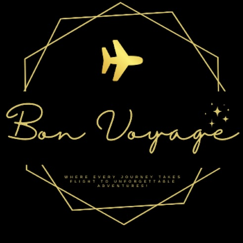

# Bon Voyage: Flight booking System Web Application

 

This project has been developed using Java Spring boot and ReactJS and is running node v12.0.0 and npm v7.19.0
 

# Installation and Setup Instructions
Clone down this repository. You will need `node` and `npm` installed globally on your machine.

### Installation:
Install npm modules:
`npm install`

To Start Server:
`npm start`

To Visit App:
`localhost:3000`

In case of any errors (ensure the number of vulnerabilities is less than 10 - sometimes running twice helps!)
`npm audit fix --force`

Installing database component for react
`npm install react-data-table-component`

#### Landing page is `home.jsx`, add all routes in it
 

# Creating google authentication
1. Login to https://console.cloud.google.com/
2. Go to APIs & Services, click on Credentials in the left pane
3. Click on create credentials, select OAuth Client ID request
4. Select application as Web Application, give it a name
5. Provide Authorised JavaScript origins as 
"http://127.0.0.1:3000"
"http://localhost:3000"
6. Provide Authorised redirect URIs as  
"http://127.0.0.1:3000/callback"
"http://localhost:3000/callback"

## Frontend Web Pages
#### Flight Search Page

#### Google Authentication for Secure Login

#### Seat Selection
Black: Booked
Green: Selected
Gray: Available
 

#### Payment Page
 

#### Flight Seat Booking Confirmation
 

#### Manage Bookings
 
 
 

#### Admin Pages
 
 
 
  